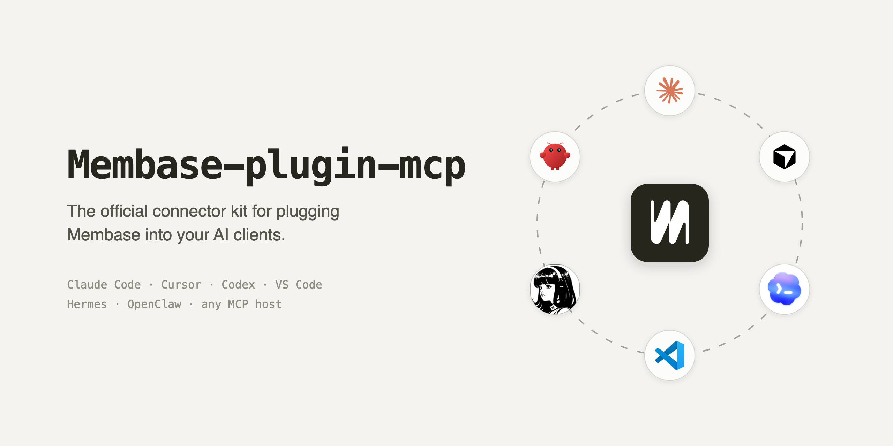

<p align="center">
  <a href="https://membase.so">
    
  </a>
</p>

[](https://cursor.com/en/install-mcp?name=membase&config=eyJ1cmwiOiJodHRwczovL21jcC5tZW1iYXNlLnNvL21jcCJ9) [](https://insiders.vscode.dev/redirect/mcp/install?name=membase&config=%7B%22type%22%3A%20%22http%22%2C%20%22url%22%3A%20%22https%3A%2F%2Fmcp.membase.so%2Fmcp%22%7D) [](./LICENSE) [](./CONTRIBUTING.md) [](https://discord.gg/vHgtDd6UTK)

## Use cases

Most AI tools forget everything the moment a chat ends. Context you've already
explained — your stack, your preferences, decisions you made last week — has to
be re-explained every session, and it never carries across to a different tool.
With Membase, your agents share one persistent memory:

- **Persistent project context** — your agent remembers your stack, conventions,
  and past decisions instead of asking again every session.
- **Cross-tool continuity** — capture something in Claude Code and recall it in
  Cursor or Codex, because they share one memory.
- **Long-running work** — pick up a multi-day task with the relevant history
  pulled back into context automatically.
- **Personal knowledge** — save facts, preferences, and notes once and let any
  connected agent retrieve them on demand.

## Installation

One command, every detected client (Claude Code, Cursor, Codex):

```bash
npx plugins add aristoapp/membase-plugin-mcp
```

Or Claude Code alone, via its plugin marketplace:

```bash
claude plugin marketplace add aristoapp/membase-plugin-mcp
claude plugin install membase@membase-plugins
```

Per-client manual setup below. 
Every client connects to the same hosted MCP server:
`https://mcp.membase.so/mcp`.

<details>
<summary><b>Claude Code</b></summary>

```bash
claude mcp add --transport http membase https://mcp.membase.so/mcp
```

Want auto-capture and cross-session handoff too? Install the Membase
**plugin** (a bundled MCP server plus hooks) instead — the repo root is the
plugin package; see the install commands above or [clients/claude](clients/claude).

Full guide: [docs/install/claude.md](docs/install/claude.md)

</details>

<details>
<summary><b>Cursor</b></summary>

Click to install:

[](https://cursor.com/en/install-mcp?name=membase&config=eyJ1cmwiOiJodHRwczovL21jcC5tZW1iYXNlLnNvL21jcCJ9)

Or add it by hand to `.cursor/mcp.json` (this project) or `~/.cursor/mcp.json`
(all projects):

```json
{
  "mcpServers": {
    "membase": {
      "url": "https://mcp.membase.so/mcp"
    }
  }
}
```

Full guide: [docs/install/cursor.md](docs/install/cursor.md)

</details>

<details>
<summary><b>Codex CLI</b></summary>

```bash
codex mcp add membase --url https://mcp.membase.so/mcp
codex mcp login membase
```

Or add it to `~/.codex/config.toml` (global) or `.codex/config.toml`
(this project):

```toml
[mcp_servers.membase]
url = "https://mcp.membase.so/mcp"
```

Full guide: [docs/install/codex.md](docs/install/codex.md)

</details>

<details>
<summary><b>VS Code</b></summary>

Click to install:

[](https://insiders.vscode.dev/redirect/mcp/install?name=membase&config=%7B%22type%22%3A%20%22http%22%2C%20%22url%22%3A%20%22https%3A%2F%2Fmcp.membase.so%2Fmcp%22%7D)

Or add it to your MCP config (`.vscode/mcp.json`):

```json
{
  "servers": {
    "membase": {
      "type": "http",
      "url": "https://mcp.membase.so/mcp"
    }
  }
}
```

</details>

<details>
<summary><b>Hermes Agent</b></summary>

Add the server under `mcp_servers` in `~/.hermes/config.yaml`:

```yaml
mcp_servers:
  membase:
    url: "https://mcp.membase.so/mcp"
```

Prefer a native integration? Hermes also ships a Python provider package —
see [clients/hermes](clients/hermes).

Full guide: [docs/install/hermes.md](docs/install/hermes.md)

</details>

<details>
<summary><b>OpenClaw</b></summary>

**Remote MCP (simplest).** Add Membase to your OpenClaw MCP config:

```json
{
  "mcpServers": {
    "membase": {
      "url": "https://mcp.membase.so/mcp"
    }
  }
}
```

**Native plugin (richer — auto-capture and recall).** From an OpenClaw checkout:

```bash
openclaw plugins install --link ./clients/openclaw
openclaw plugins enable openclaw-membase
openclaw gateway restart
```

Full guide: [docs/install/openclaw.md](docs/install/openclaw.md)

</details>

<details>
<summary><b>Other MCP hosts</b> (ChatGPT, Gemini CLI, OpenCode, Poke, …)</summary>

Any MCP-capable host can connect with the generic remote config plus the
OAuth prompt on first use:

```json
{
  "mcpServers": {
    "membase": {
      "url": "https://mcp.membase.so/mcp"
    }
  }
}
```

</details>

## Tools

Every connector reaches the same hosted MCP tool set:

`add_memory` · `search_memory` · `add_wiki` · `search_wiki` · `update_wiki` · `delete_wiki` · `get_current_date`

Clients with a native runtime (Claude Code, OpenClaw, Hermes) make memory
automatic: 
just work, and your sessions are captured, recalled, and handed off for you. 
Details in each client's install guide.

Anything important, save it yourself and pull it back later — plain language
is enough, the agent calls the tools for you:

```txt
Remember that we deploy from the release branch, never from main.
```

```txt
What did we decide about the auth flow last week?
```

```txt
Save this: the staging database resets every night at 02:00 UTC.
```

## How it works

Connectors talk to a stable Membase Context API.

```text
Client plugin or MCP config      ← per-client adapter (clients/*)
        │
        ▼
Shared connector core            ← packages/core, packages/connector-sdk
        │
        ▼
Membase Context API              ← stable public surface
        │
        ▼
Private Membase memory engine    ← storage, graph, ranking (not in this repo)
```

Client-specific behavior stays in
`clients/*`; shared behavior lives in `packages/*`. A CI guard fails the build
if any internal Membase term (storage schema, graph, embeddings, ranking) leaks
into the public surface.

> **Note:** This repository is the connector/integration layer only. The
> Membase Context API, memory engine, and their supporting services are a
> separate, private system and are not part of this repo.

For the full design rationale, see [docs/architecture.md](docs/architecture.md)
and the "where does X live" map in [MAP.md](MAP.md).

## Contributing

Contributions are welcome! This is a [pnpm](https://pnpm.io) monorepo
(**Node.js 20+**, **pnpm 11+**):

```bash
pnpm install
pnpm check
```

`pnpm check` is the full gate: it typechecks the workspace, verifies that
committed manifests match adapter-generated output, runs the connector smoke
tests, scans for accidentally committed secrets, and enforces the public
surface boundary. Run it before opening a pull request.

Adding a new MCP host is often just a descriptor — `defineMcpHostAgent()` in
`packages/connector-sdk` — plus a regen, not a hand-written adapter. See
[CONTRIBUTING.md](CONTRIBUTING.md) for the setup, the branch → `pnpm check` →
PR flow, and how to add a connector, and please review our
[Code of Conduct](CODE_OF_CONDUCT.md).

## Security

Please do not open public issues for security problems. See
[SECURITY.md](SECURITY.md) for how to report a vulnerability, and
[docs/security.md](docs/security.md) for the connector secret-handling and
redaction model.

## License

Released under the [MIT License](LICENSE).
